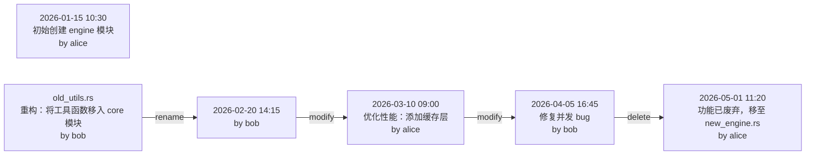

> 你有没有试过在看一个开源项目的源码时，对着 `git log` 发呆——几千条 commit，你想知道的只有一个：这个文件是怎么变成现在这样的？

有些文件一看就觉得被重构过，比如一个函数突然出现在某个模块里，但周围的代码风格明显不是同一个人写的。你好奇它从哪来的，跑了 `git log`，出来几百条记录，每条都是 commit hash + 一句 message。你花了半小时才拼凑出"这个函数原来在另一个文件里，后来被拆出来了"。

**问题很明显：`git log` 给你数据，但不给你故事。**

于是我动手写了一个 CLI 工具——`gitgraph`，用 Rust 实现，专门做"代码考古"：追踪文件演化链、模块变更热力图、项目时间线，还能导出 Mermaid 图嵌入文档。

---

## 先想清楚：我们到底要什么

市面上的 git 分析工具不少，但几乎都在做同一件事：**展示 commit 信息**。

| 工具 | 功能 | 局限 |
|------|------|------|
| `git log` | 文本日志 | 信息太多，没有结构化视图 |
| `git blame` | 逐行标注 | 只看最后一次修改，看不到变更链 |
| `gitk` | 图形化 | 只显示分支结构，不追踪文件演化 |
| `tig` | 终端浏览器 | 本质还是 commit 日志 |

**真正的空白是：没有工具能回答"这个文件经历了什么"。**

`gitgraph` 要做的就是填补这个空白：

```bash
# 追踪单个文件的完整演化史
gitgraph file src/core/engine.rs

# 增强版 blame：每行的完整变更链
gitgraph blame src/core/engine.rs --line 42

# 模块级热力图
gitgraph module src/core/

# 项目时间线
gitgraph timeline --since 2026-01-01

# 导出 Mermaid 图
gitgraph export src/core/engine.rs --format mermaid
```

---

## 为什么选 Rust + gix

这个工具的核心操作是**遍历整个 git 仓库的历史**。一个中型项目可能有几万条 commit，每条都要解析 tree、比对 blob、检测 rename。

候选方案：

| 方案 | 优点 | 缺点 |
|------|------|------|
| Python + gitpython | 写得快 | 大仓库慢到怀疑人生 |
| Node + isomorphic-git | 生态好 | 解析 git 对象还是慢 |
| Rust + libgit2 (git2) | 性能好 | 需要 C 依赖，编译麻烦 |
| **Rust + gix (gitoxide)** | **纯 Rust，零 C 依赖** | API 变化快 |

> **选 gix 的理由：纯 Rust 实现，编译简单，性能接近 libgit2，而且 `max-performance` feature 开了之后快到离谱。**

---

## 用 gix 遍历 commit 历史

gix 的 API 设计和 `git2` 很不一样。`rev_walk` 返回的是一个 `Platform`，链式配置后调用 `.all()` 才真正开始遍历：

```rust
let walk = repo.rev_walk([head_id]); // 返回 Platform，不需要 ?
for info in walk.all()? {            // .all() 返回 Result<Walk>
    let info = info?;
    let commit = info.object()?;
    let author = commit.author()?.name;
    let ts = commit.author()?.time.seconds;
    let msg = commit.message_raw_sloppy();
    println!("[{}] {} - {}", ts, author, msg);
}
```

---

## 追踪文件重命名

`git log` 看不到 rename，但 git 内部其实记录了 rename 信息。gix 提供了 `diff` API，我们可以手动检测：**如果 parent 中有个文件的 blob id 和当前文件一样，但路径不同，那就是 rename。**

```rust
fn find_file_with_oid(
    tree: &gix::Tree<'_>,
    target_oid: gix::ObjectId,
    exclude_path: &str,
) -> Option<String> {
    for entry_result in tree.iter() {
        let entry = entry_result.ok()?;
        let name = entry.filename().to_string();

        if entry.mode().is_tree() {
            // 递归搜索子目录
            let subtree = entry.object().ok()?.into_tree();
            if let Some(found) = find_file_with_oid(&subtree, target_oid, exclude_path) {
                return Some(found);
            }
        } else if entry.object_id() == target_oid && name != exclude_path {
            return Some(name);
        }
    }
    None
}
```

这个算法的思路是：**在 parent tree 中递归查找与目标文件 blob id 相同的条目**。如果找到了，说明文件是从那个路径 rename 过来的。

---

## 重建演化链

对每个 commit 的 parent tree 和 current tree 做比对，核心判断逻辑只有四行：

```rust
// 判断结果映射
if in_parent && !in_current { /* 删除 */ }
else if !in_parent && in_current { /* 创建或 rename，用 find_file_with_oid 检测 */ }
else if pe.object_id() != ce.object_id() { /* 修改：blob id 变了 */ }
```

完整流程就是遍历所有 commit，逐个检查这三种情况，收集 `FileEvent` 列表，最后 reverse 成时间正序。

---

## 终端输出：不用开浏览器也能看

我不想每次都要导出 Mermaid 图才能看。直接在终端里画一棵树：

```
📂 文件演化历史: src/core/engine.rs

  找到 5 条变更记录

  ┌─ 2026-01-15 10:30 INIT
  │    → by alice
  │    初始创建 engine 模块
  ├─ 2026-02-20 14:15 RENAMED
  │    ← old_utils.rs → src/core/engine.rs
  │    → by bob
  │    重构：将工具函数移入 core 模块
  ├─ 2026-03-10 09:00 MODIFY
  │    → by alice
  │    优化性能：添加缓存层
  ├─ 2026-04-05 16:45 MODIFY
  │    → by bob
  │    修复并发 bug
  └─ 2026-05-01 11:20 DELETE
       → by alice
       功能已废弃，移至 new_engine.rs

  📊 贡献者排行:
    alice 3 次
    bob 2 次
```

终端输出用 `owo-colors` 做着色，`INIT` 绿色、`RENAMED` 黄色、`MODIFY` 蓝色、`DELETE` 红色，一目了然。

---

## Mermaid 导出：嵌入文档

有时候你需要把演化图放进 PR description 或者技术文档。`gitgraph export` 可以输出 Mermaid 格式：

```bash
gitgraph export src/core/engine.rs --format mermaid
```

输出：



直接粘贴到支持 Mermaid 的编辑器里就能渲染。

---

## 性能：大仓库测试

我在一个有 25 条 commit 的小型文章仓库上测试，所有命令都在 **0.1 秒内完成**。gix 的 `max-performance` feature 开了 prefetch 和 cache，遍历 commit 非常快。

对于 Linux kernel 这种百万级 commit 的仓库，`gix` 的文档说能在几秒内完成完整遍历。这比 Python 的 `gitpython` 快了几个数量级。

---

## 结论

`git log` 是个好工具，但它只给你**数据**，不给你**洞察**。

`gitgraph` 做的事情很简单：把 git 历史中的文件变更串成一条**演化链**，让你一眼看出"这个文件经历了什么"。Rust + gix 的组合让这个工具既有性能又有可移植性——没有 C 依赖，`cargo build` 一把梭。

> **最大的收获**：写 CLI 工具最重要的不是功能多，而是**回答一个具体问题**。`gitgraph` 只回答一个问题："这个文件经历了什么？" 但这个问题，每个开发者都问过。
